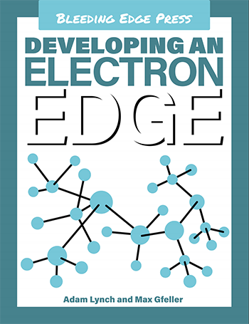

# developing-an-electron-edge

The code examples and example apps to go along with the [*Developing an Electron Edge*](https://bleedingedgepress.com/developing-an-electron-edge/) book by Adam Lynch and Max Gfeller ([Bleeding Edge Press](https://bleedingedgepress.com/)).

If you spot any mistakes, feel free to create an issue or pull-request. Enjoy!

## Updates and corrections

- In chapter 1, `bindings.gyp` should have been named `binding.gyp`. The file has been updated in this repository. See [#4](https://github.com/adam-lynch/developing-an-electron-edge/pull/4).
- This is frustrating but the `remote` module was required incorrrectly three times (see page 50 for example). Instead of `require('remote')`, it should have been `require('electron').remote`. This has been corrected in all applicable examples in this repository. This was a stupid mistake on our part. We're sorry. See [#7](https://github.com/adam-lynch/developing-an-electron-edge/pull/7)
